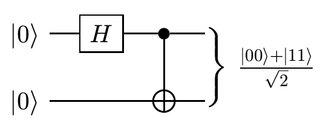
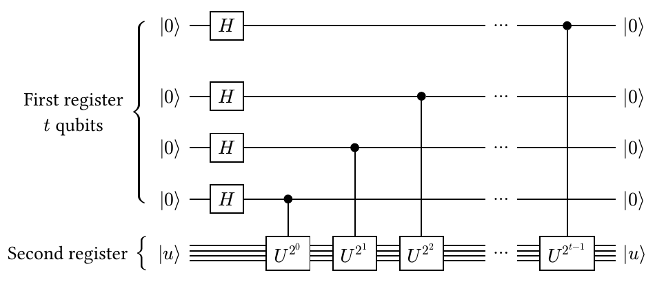
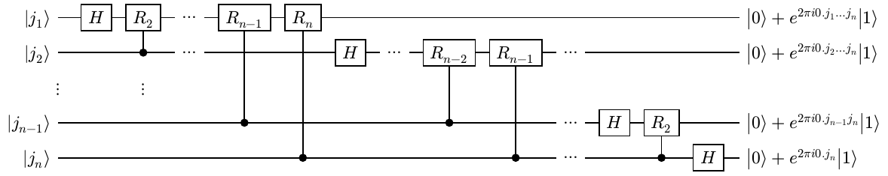
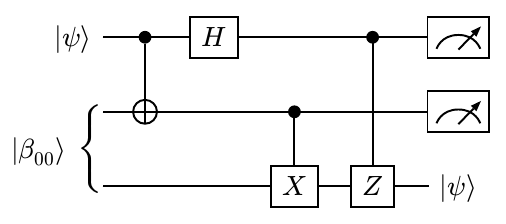

<h1 align="center">
  
</h1>


<!-- <p align="center">
  <a href="https://github.com/Mc-Zen/typst-quantum-circuit/blob/main/LICENSE">
    
  </a>
</p> -->

Quantum-Circuit is a library for creating quantum circuit diagrams in [Typst](https://typst.app/). 

Note, that this library is still in beta and may still be undergoing breaking changes. As new features like data types and scoped functions will be added to Typst, this library will be adapted to profit from the new paradigms. 

Meanwhile, we suggest importing everything from `quantum-circuit.typ` in a local scope to avoid polluting the global namespace (see example below). 

## Setup

Since there is no package manager for Typst yet, in order to use this library, download the [quantum-circuit.typ](./qcircuit.typ) file and place it in your Typst project. 

## Examples

Let's look at a basic introduction example:
```java
#{
  import "quantum-circuit.typ" : *
  quantum-circuit(
    lstick($|0〉$), gate($H$), control(1), rstick($(|00〉+|11〉)/√2$, num-qubits: 2), [\ ],
    lstick($|0〉$), 1, targ, 1
  )
}
```


Circuit diagrams are created by calling the function `quantum-circuit()` with any number of positional arguments - just like the builtin functions `table()` or `grid()`. A variety of different gate and instructions commands are available and plain numbers can be used to produce any number of empty cells just filled with the current wire mode. A new wire is started by adding the content item `[\ ]`. 

A user guide exists which you can find [here](docs/quantum-circuit-guide.pdf).

Some show-off examples, loosely replicating figures from [Quantum Computation and Quantum Information by M. Nielsen and I. Chuang](https://www.cambridge.org/highereducation/books/quantum-computation-and-quantum-information/01E10196D0A682A6AEFFEA52D53BE9AE#overview).





<!--  -->